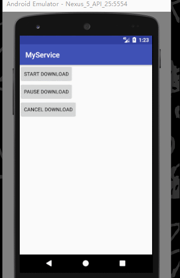
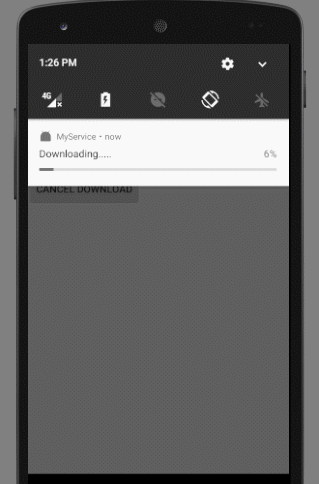
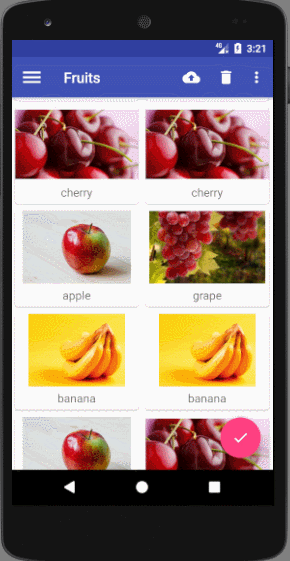
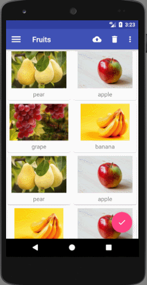
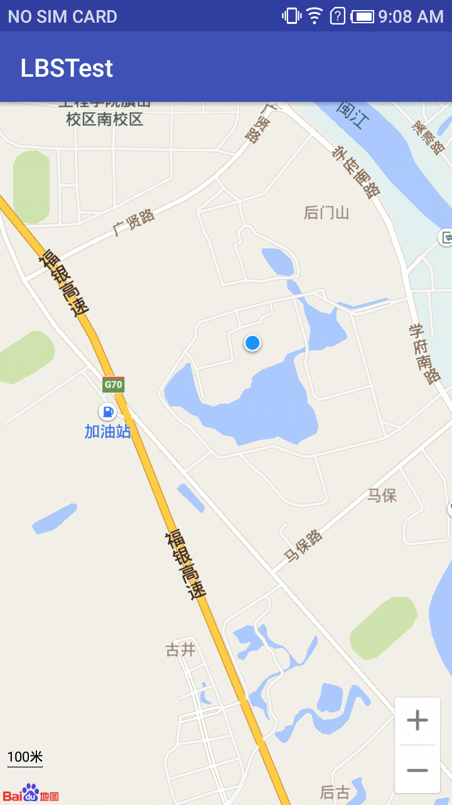
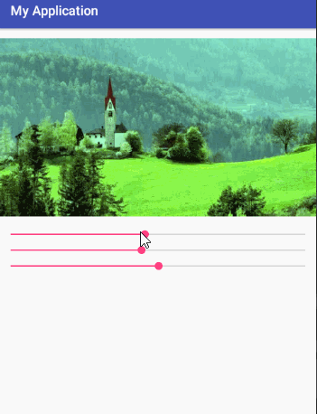
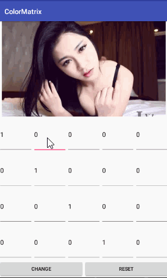
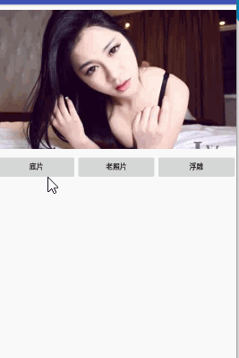
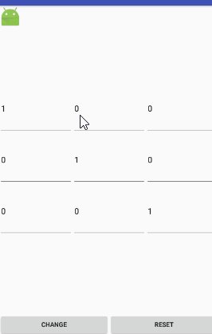

# Android-Notes
Android project from some books.

### MyService
This is a Android project from  ***The First Line Cod*** chapter 9.
There are some picture show the result of this project.




### MaterialDesignDemo
This is a Android project from chapter 12.




### LBSTest

This is a Android project by using BaiduMap



-------------------
## AndroidHeros

The demos come from  ***AndroiHeros***


### DrawDemo 
This is a demo showing how to change hue , saturability  and luminance with SeekBar. you can see it in **app** package.



-----

I use  20 EditTexts to discribe the element of 4*5 ColorMatrix. When you change any of EditTexts , the image will  display different  result.This demo is in **colormatrix** package.
 



---

This  demo is  in the package **pixeltest** . In order to deal with  image  accurately, we can use Bitmap.getPixels() method to deal with image.  Bitmap.getPixels() method use a array to preserve pixel. 

``` java
bitmap.getPixels(pixels,offest,stride,x,y,width,height);
```


---




---

As we can see in the colormatrix package, we also use matrix to show the shape and position change of image. This demo in the **matrixtest** package. 



---


In package **flagview**, it just use drawBitmapMesh()  to change image shape.

